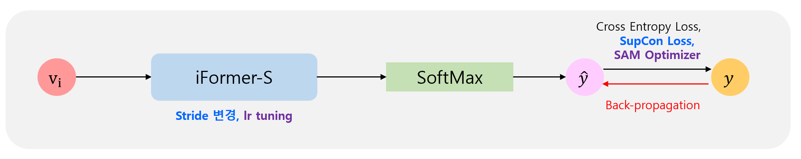

# 한밭대학교 컴퓨터공학과 봇듀오 팀

**팀 구성**
- 20191766 김동수
- 20211915 오서연

## 필요성
- 데이터에 비밀리에 악성 코드와 같은 데이터를 삽입하는 스테가노그래피 기술에 대응하기 위해 숨겨진 데이터를 탐지하는 스테그어날리시스 기술이 사용되고 있다. 하지만, 숨겨진 데이터는 굉장히 미세해서 육안으로는 확인하기 어렵고, 커버 데이터의 촬영 환경과 같은 도메인 정보에 굉장히 민감하게 반응하여 성능에 큰 영향을 끼친다. 
- 이를 해결하기 위해 최적의 Backbone 모델과 학습 방법을 탐색하고, 가장 우수한 성능을 보이는 방식을 선정하였다. 또한, 학습에 사용된 기기의 데이터뿐만 아니라 다른 기기에서 생성된 데이터로도 성능을 평가하여, 실제 환경에서의 스테그어날리시스 성능을 개선한다.

## 시스템 디자인
  - ### 시스템 요구사항
      - Ubuntu 20.04.4 LTS
      - Python 3.8.16
      - CUDA 11.8
      - GPU : NVIDIA A6000 48G x 2
      - CPU : AMD EPYC 7642 48-Core Processor
      - Memory : 40G

## 사례 연구
- ### 개요
  - 데이터셋

    

    - 공간영역: 총 14종 기기의 PNG 포맷 데이터 사용
    - 압축영역: 총 19종 기기의 JPEG 포맷 데이터 사용

  - 시스템 개요

    
    - 모델 성능개선을 위해 Laerning Rate 탐색, 모델의 Stride를 (2, 2)에서 (1, 1)로 변경
    - 모델의 일반화 성능개선을 위해 Sharpness-Aware Optimizer, Supervised Contrastive Loss 사용

## 주요 실험 결과
- ### 공간영역(PNG) 실험 결과
  | Method                      | Intra Accuracy | Inter Accuracy |
  |-----------------------------|----------------|----------------|
  | Baseline                    | 92.58          | 88.30          |
  | SAM(0.05)                   | 98.16          | 95.76          |
  | 7(CE):3(SupCon)             | 92.85          | 88.50          |

- ### 압축영역(JPEG) 실험 결과
  | Method                      | Intra Accuracy | Inter Accuracy |
  |-----------------------------|----------------|----------------|
  | Baseline                    | 94.05          | 83.87          |
  | SAM(0.05)                   | 95.10          | 84.29          |
  | 7(CE):3(SupCon)             | 94.51          | 84.98          |
  | SAM(0.001), 7(CE):3(SupCon) | 95.05          | 84.11          |

## 결론
- 선정된 Backbone 모델 및 학습 기법을 사용하여 모델의 일반화 성능을 개선하여 다양한 촬영 환경 변화에도 안정적인 성능을 유지할 수 있다. 이로 인해 숨겨진 악성 코드나 데이터를 더 정확하게 탐지할 수 있어, 실제 환경에서 스테가노그래피 공격에 대한 보안 대응할 수 있다. 이러한 일반화 성능 덕분에 다양한 기기와 플랫폼에서 동일한 성능을 보장해, 다양한 보안 시스템에 폭넓게 활용될 수 있다.
  
## 참고 문헌
- Inception Transformer(iFormer): https://arxiv.org/abs/2205.12956
- Sharpness-Aware Optimizer(SAM): https://arxiv.org/abs/2010.01412
- Supervised Contrastive Loss(SupCon): https://arxiv.org/abs/2004.11362
